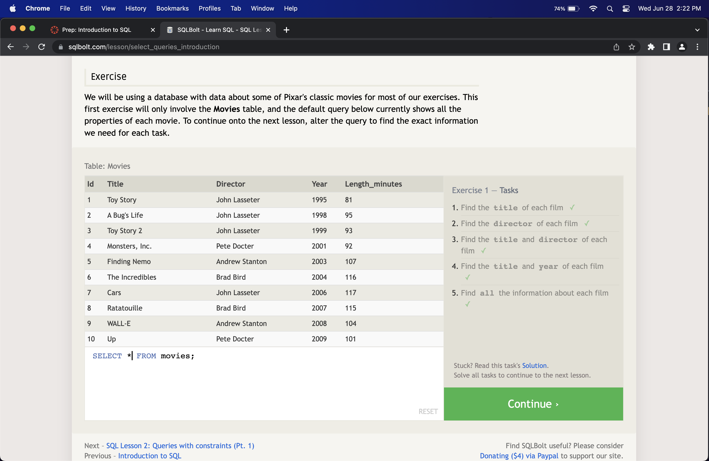
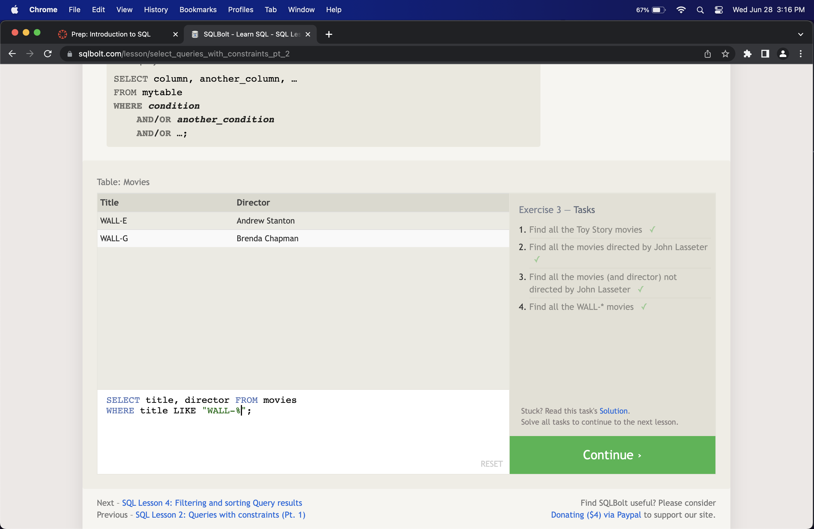
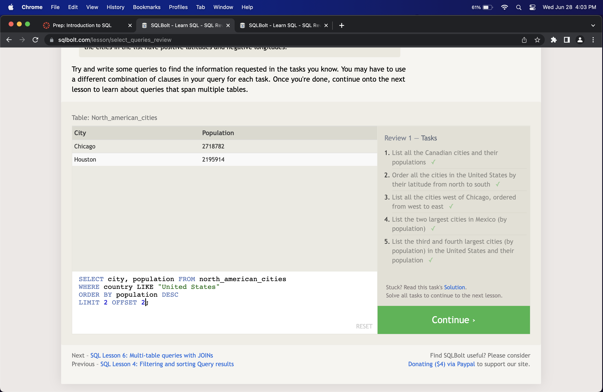
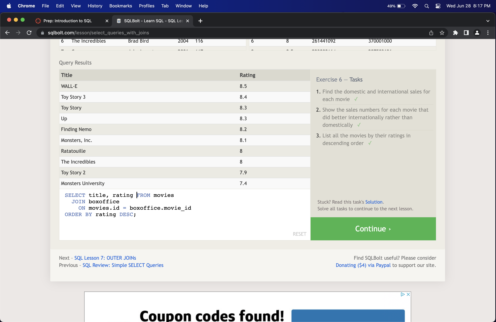
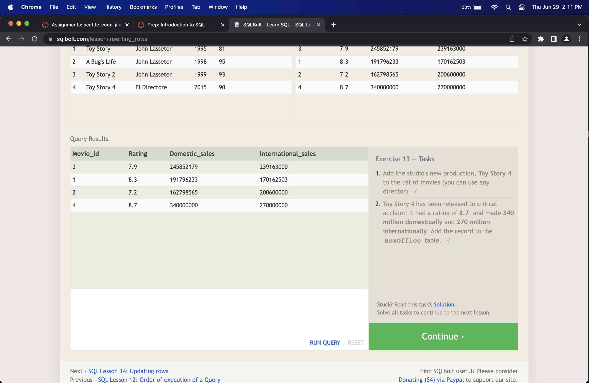
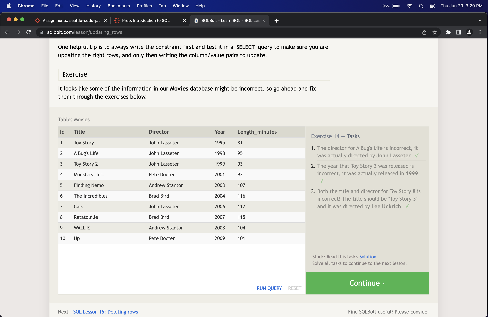
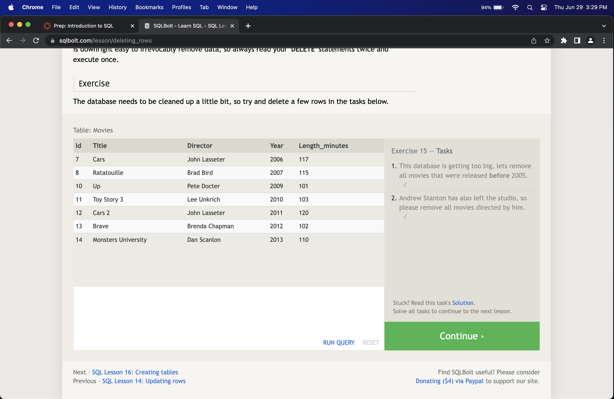
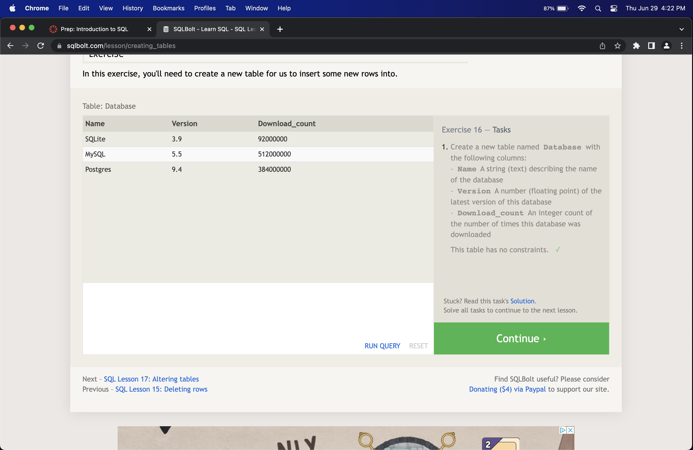
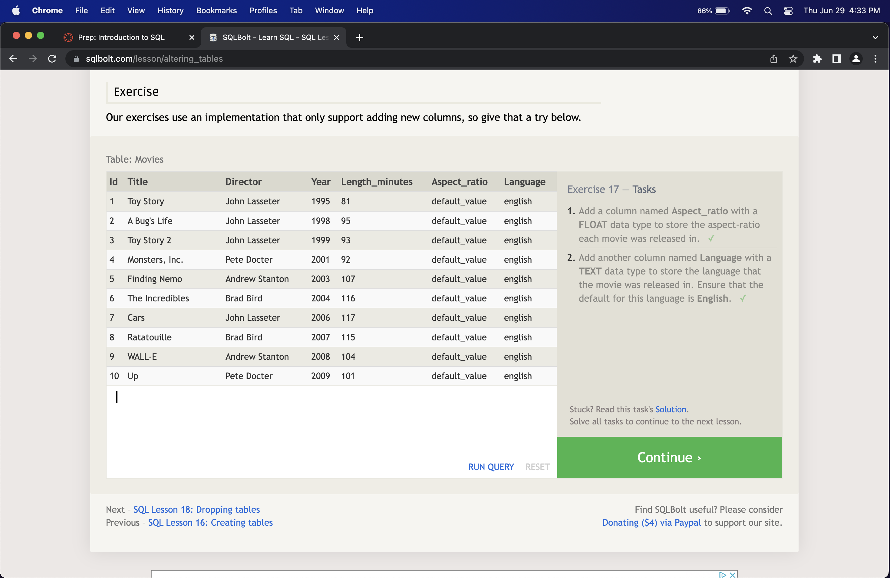

# Introduction to SQL

1. SQL is the language used to manage and query a database. SQL is a standard language used by most relational database management systems (RDBMS) such as MySQL, Oracle, MS SQL Server, and others.

2. SQL Leasons Learned 1-6

3. SQL Leasons Learned 13-18

  

## Resources I use

SQL Database Tutorial for Beginners[^1] and SQL Bolt[^2]

[^1]: [SQL](https://www.computer-pdf.com/3-sql-database-tutorial-for-beginners)
[^2]: [SQL Bolt](https://sqlbolt.com/)
